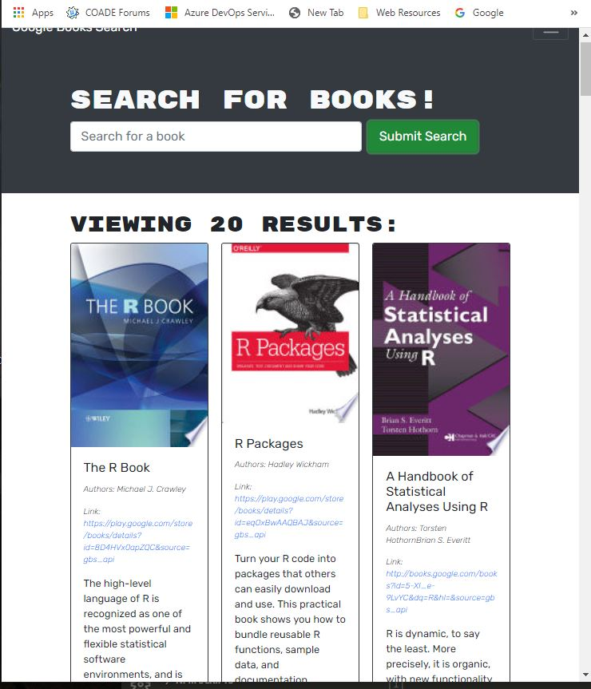
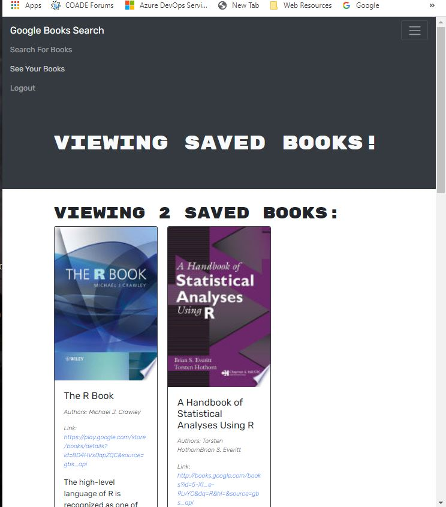

# Book Search Engine (Refactoring)
(Richard Ay - December-January 2020/21)

## Table of Contents
* [Project Objective](#project-objective)
* [Acceptance Criteria](#acceptance-criteria)
* [Technologies Used](#technologies-used)
* [Deployment Link](#deployment-link)
* [Application Screen Shot](#application-screen-shot)

## Project Objective
As an avid reader I want to search for new books to read so that I can keep a list of books to purchase.  This project starts with a fully functioning Google Books API, then refactors it to be a GraphQL API built with Apollo Server.  The existing RESTful APIs will be replaced with GraphQL queries and mutations.

For refactoring steps see: 'refactoring_steps.md'.

## Acceptance Criteria
Given a book search engine:

* When I load the search engine then I am presented with a menu with the options Search for Books and Login/Signup and an input field to search for books and a submit button.

* When I click on the Search for Books menu option then I am presented with an input field to search for books and a submit button.

* When I am not logged in and enter a search term in the input field and click the submit button then I am presented with several search results, each featuring a book’s title, author, description, image, and a link to that book on the Google Books site.

* When I click on the Login/Sign-up menu option then a modal appears on the screen with a toggle between the option to log in or sign up.

* When the toggle is set to Sign-up then I am presented with three inputs for a username, an email address, and a password, and a sign-up button.

* When the toggle is set to Login then I am presented with two inputs for an email address and a password and login button.

* When I enter a valid email address and create a password and click on the sign-up button then my user account is created and I am logged in to the site.

* When I enter my account’s email address and password and click on the login button then the modal closes and I am logged in to the site.

* When I am logged in to the site then the menu options change to Search for Books, an option to see my saved books, and Logout.

* When I am logged in and enter a search term in the input field and click the submit button then I am presented with several search results, each featuring a book’s title, author, description, image, and a link to that book on the Google Books site and a button to save a book to my account.

* When I click on the Save button on a book then that book’s information is saved to my account.

* When I click on the option to see my saved books then I am presented with all of the books I have saved to my account, each featuring the book’s title, author, description, image, and a link to that book on the Google Books site and a button to remove a book from my account.

* When I click on the Remove button on a book then that book is deleted from my saved books list.

* When I click on the Logout button then I am logged out of the site and presented with a menu with the options Search for Books and Login/Sign-up and an input field to search for books and a submit button.  

## Technologies Used

* GraphQL
* Apollo Server
* JWT (JSON Web Token)
* NodeJS, Express.JS
* MongoDB
* React

## Deployment Link
The deployment link on Heroku is: https://book-search-ay.herokuapp.com   
[Heroku](https://book-search-ay.herokuapp.com/) 

## Application Screen Shot

 Image of search results.

 Image of saved books.

